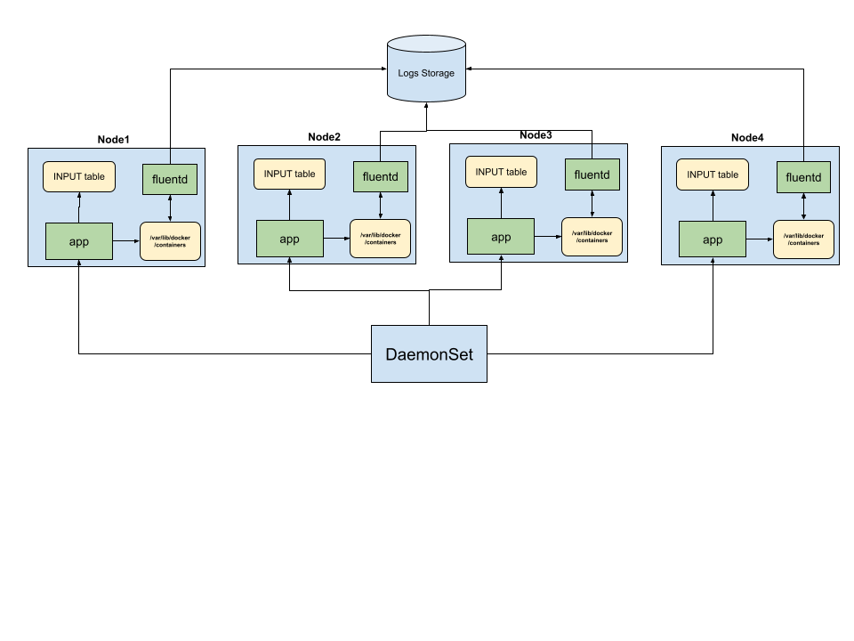

# Iptables Firewall Rules Script
The application is designed to automate the management of [Node](https://kubernetes.io/docs/concepts/architecture/nodes/) iptables firewall rules based on [Consul catalog](https://developer.hashicorp.com/consul/api-docs/catalog) data or catalog file. <br />
The script is designed to be deployed in a Kubernetes cluster using a DaemonSet and a CronJob inside container to run periodically on each node,  <br />
ensuring the firewall rules are always up-to-date.

## Requirements

- Python 3.6 or later
- `python-iptables` library
- Consul with the catalog data available

## Overview
**main.py** - iptables Firewall app <br />
**logger_config.py** - logger object configuration <br />
**requirements.txt** - required packages <br />
**rules.json** - iptables rules configuration that need to be applied for a host <br />
**nodes.json** - list of mocked nodes with metadata (Consul) <br />

## Local testing
1. Use the [Docker](https://docs.docker.com/reference/cli/docker/image/build/) to create a docker image.
From application root dir run:
```bash
docker build -t iptables-firewall .
```
2. Run [docker container](https://docs.docker.com/reference/cli/docker/container/run/) with ___--privileged___ to have 
access to iptables inside container. If you want use mocked host ip address also need to add ___-e___ with any ip address 
from **services.json**
```bash
docker run --privileged -e MOCKED_HOST_IP='10.10.0.17' iptables-firewall
```
### Alternative way to test
1. Build docker image:
```bash
docker build -t iptables-firewall .
```
2. Exec inside container:
```bash
docker run --privileged -ti c142e7addff9 bash 
```
3. Add env var of the node that you want to test:
```bash
export MOCKED_HOST_IP=10.10.17
```
4. Run script:
```bash
python main.py 
```
You can play with different ip addresses from nodes.json and check the result.
## Kubernetes installation 
1. Build and Push Docker Image:
```bash
docker build -t docker-registry/iptables-firewall:latest .
docker push docker-registry/iptables-firewall:latest
```
2. Apply the DaemonSet to your Kubernetes cluster:
```bash
kubectl apply -f iptables-daemonset.yaml
```
3. Check the Logs:
```bash
kubectl logs <pod-name>
```

 - The Pod in DaemonSet will be running on each node and using `NET_ADMIN` capability and `hostNetwork: true`, `hostPID: true`
will interact with host namespaces.
 - Centralized logging allows for easier log collection and analysis, as logs from multiple containers and services can be aggregated and analyzed centrally.<br />


### Disadvantages of this approach
First of all, this project was created for educational purposes and does not claim to be a perfect solution for managing iptables.
- Programming language: Python is slower than some compiled programming languages like Go. If we'll have a lot of rules and <br />
Consul catalog data, applying rules will take some time.
- Application consist of searching algorithms with O(n²+), for my opinion, some of them can be optimized.
- Currently, rules placed in the file, which also not good approach, operation with file system are very heavy, <br />
so for keeping firewall rules better to use some key-value storage (etcd).
- `iptc` library works with iptables-legacy instead of iptables-nft, according to the old version of iptables-legacy it could be <br />
deprecated in a future major version of Linux core, in which case our script will need to be updated.
- For K8s usage we should use other basic docker image to optimize size.
- Application works with main CHAIN, it means that there may be conflicts with kube-proxy if we deside to run in K8s cluster, <br />
in this case we have to create custom CHAIN.
- Application creates rules for nodes from different environments (test, prod), according to existing logic nodes from test  <br />
can make request to nodes from prod. This is for educational purposes only and can be fixed of need.
### Alternative usage
For alternative approach to running this application we can use [kubernetes operator](https://kubernetes.io/docs/concepts/extend-kubernetes/operator/), in this case we'll need to create custom <br />
controller, but we'll get more benefits of declarative approach and better integration with K8s ecosystem. 
